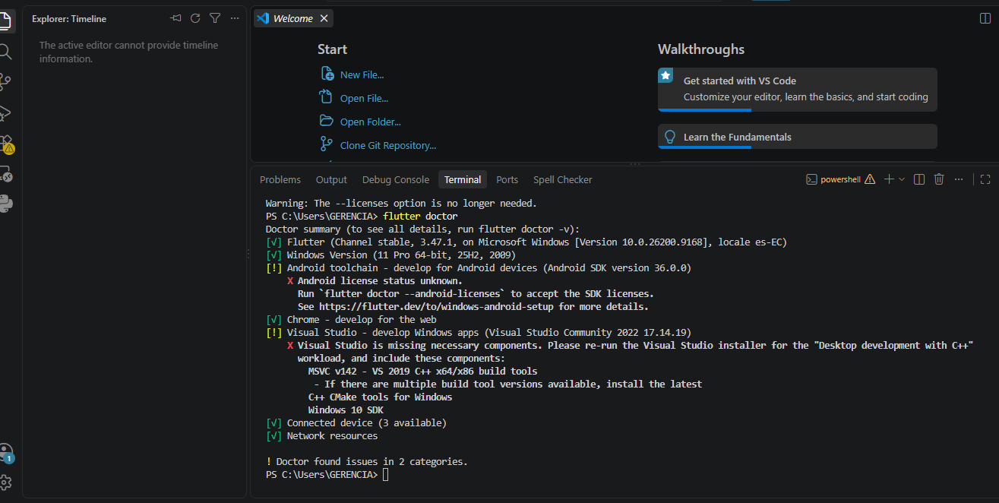
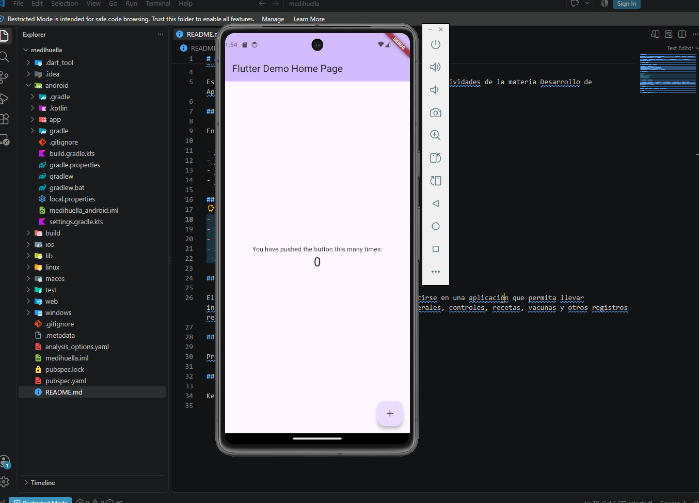
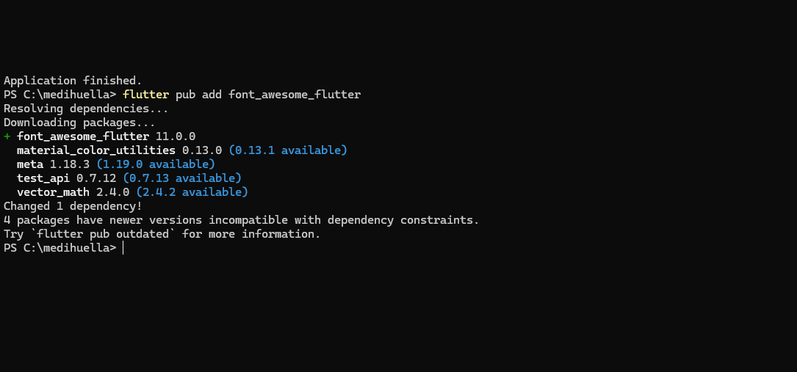
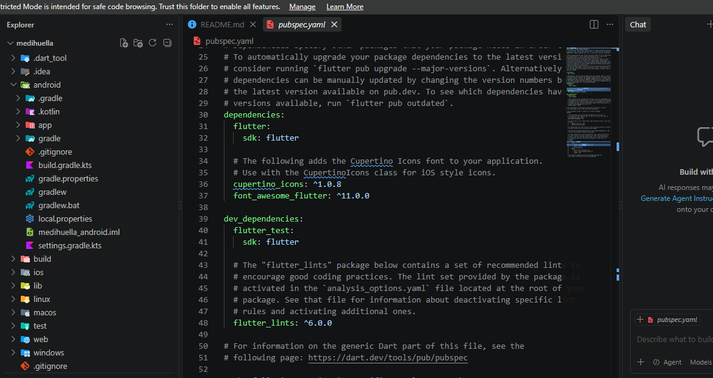
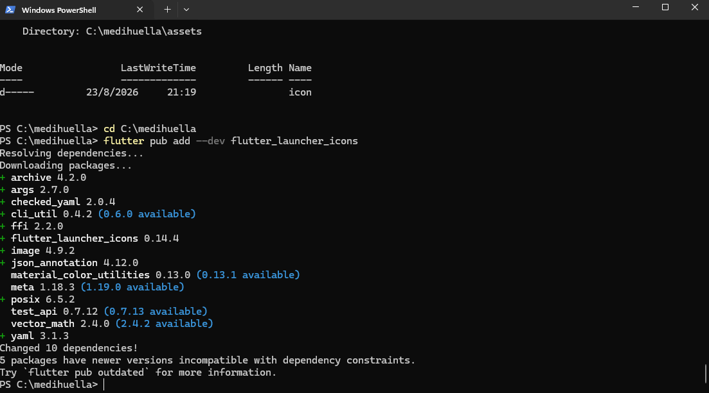

# MediHuella 🐾

Aplicación móvil desarrollada con Flutter y Dart como parte de la asignatura Desarrollo de Aplicaciones Móviles.

MediHuella está orientada al registro y seguimiento de información relacionada con la salud y el cuidado de las mascotas.

## Autor

**Kevin Geovanny Minga Espinoza**

## Objetivo

Desarrollar una aplicación básica en Flutter que demuestre la creación de un proyecto, el uso de widgets, la ejecución en un emulador Android, la utilización de paquetes externos, una interacción mediante manejo de estado y la publicación del proyecto en GitHub.

Además de cumplir los requisitos de esta primera actividad, MediHuella fue planteada como un proyecto que podrá continuar evolucionando durante las siguientes actividades de la materia.

## Descripción de la aplicación

La pantalla principal de MediHuella presenta la información básica de una mascota mediante una interfaz organizada en tarjetas.

Para esta primera versión se utilizan datos demostrativos de una mascota llamada **Max**, mostrando:

- Nombre.
- Raza.
- Sexo.
- Edad.
- Peso.
- Estado general.
- Vacunación.
- Desparasitación.
- Controles veterinarios.
- Próximos cuidados.

La aplicación utiliza una identidad visual propia basada en tonos verdes relacionados con salud y bienestar.

## Widgets utilizados

Para construir la interfaz se utilizaron diferentes widgets de Flutter:

- `MaterialApp`
- `Scaffold`
- `AppBar`
- `SingleChildScrollView`
- `Column`
- `Row`
- `Card`
- `Container`
- `Text`
- `Icon`
- `FaIcon`
- `Padding`
- `SizedBox`
- `Divider`
- `ElevatedButton`

También se utilizó un `StatefulWidget` para manejar cambios dinámicos dentro de la pantalla.

## Paquetes externos

### font_awesome_flutter

Se utilizó el paquete `font_awesome_flutter` para incorporar iconos relacionados con mascotas y salud dentro de la interfaz.

Instalación:

```bash
flutter pub add font_awesome_flutter
```

Algunos de los iconos utilizados representan:

- Mascota.
- Vacunación.
- Peso.
- Salud.
- Desparasitación.
- Controles veterinarios.
- Calendario.

### flutter_launcher_icons

También se utilizó `flutter_launcher_icons` para generar el icono personalizado de MediHuella en Android.

Instalación:

```bash
flutter pub add --dev flutter_launcher_icons
```

La imagen principal del icono se encuentra en:

```text
assets/icon/app_icon.png
```

El icono combina una huella de mascota con un símbolo médico para representar el propósito de MediHuella.

## Interacción de la aplicación

La aplicación incluye el botón:

**Ver próximos cuidados**

Al presionarlo se muestra información adicional relacionada con:

- Próxima vacuna.
- Desparasitación.
- Control veterinario.

Para realizar esta interacción se utiliza una variable booleana llamada `mostrarCuidados`.

El cambio de estado se realiza mediante:

```dart
setState(() {
  mostrarCuidados = !mostrarCuidados;
});
```

Cuando la información está visible, el botón cambia a:

**Ocultar próximos cuidados**

Al presionarlo nuevamente, la información vuelve a ocultarse.

## Ejecución del proyecto

Para ejecutar el proyecto es necesario tener Flutter y un dispositivo o emulador Android configurado.

Instalar las dependencias:

```bash
flutter pub get
```

Comprobar los dispositivos disponibles:

```bash
flutter devices
```

Ejecutar la aplicación:

```bash
flutter run
```

También se puede seleccionar directamente un emulador utilizando:

```bash
flutter run -d ID_DEL_EMULADOR
```

## Evidencias

### Configuración del entorno

| Evidencia                              | Captura                                                 |
| -------------------------------------- | ------------------------------------------------------- |
| Ejecución de `flutter doctor`          |      |
| Proyecto abierto en Visual Studio Code |   |
| Emulador Android funcionando           |  |

### Paquetes externos

| Evidencia                               | Captura                                                                 |
| --------------------------------------- | ----------------------------------------------------------------------- |
| Instalación de `font_awesome_flutter`   |  |
| Paquete agregado en `pubspec.yaml`      |          |
| Instalación de `flutter_launcher_icons` |          |

### Funcionamiento de MediHuella

| Evidencia                                    | Captura                                                     |
| -------------------------------------------- | ----------------------------------------------------------- |
| Icono personalizado de MediHuella en Android |      |
| Pantalla principal de la aplicación          |  |
| Funcionamiento del botón y próximos cuidados |          |

## Estado del proyecto

La primera versión de MediHuella permite visualizar la información principal de una mascota y consultar de forma interactiva sus próximos cuidados.

Esta versión constituye la base del proyecto y permitirá incorporar nuevas funcionalidades en futuras actividades, como un historial más completo de salud, registros adicionales y nuevas pantallas.

## Repositorio

El código fuente del proyecto se encuentra publicado en GitHub:

https://github.com/kevingeovanny16/PROGRAMACION-IV/tree/main/ACTIVIDAD-INTEGRADORA-1/medihuella
