# MediHuella 🐾

Aplicación móvil desarrollada con Flutter y Dart como parte de la asignatura Desarrollo de Aplicaciones Móviles.

MediHuella está orientada al registro y seguimiento de información relacionada con la salud y el cuidado de las mascotas.

## Autor

**Kevin Geovanny Minga Espinoza**

## Objetivo

Desarrollar una aplicación básica en Flutter que demuestre la creación de un proyecto, el uso de widgets, la ejecución en un emulador Android, la utilización de paquetes externos, una interacción mediante manejo de estado y la publicación del proyecto en GitHub.

Además de cumplir los requisitos de esta primera actividad, MediHuella fue planteada como un proyecto que podrá continuar evolucionando durante las siguientes actividades de la materia.

## Descripción de la aplicación

La pantalla principal de MediHuella presenta la información básica de una mascota mediante una interfaz organizada en tarjetas.

Para esta primera versión se utilizan datos demostrativos de una mascota llamada **Max**, mostrando:

- Nombre.
- Raza.
- Sexo.
- Edad.
- Peso.
- Estado general.
- Vacunación.
- Desparasitación.
- Controles veterinarios.
- Próximos cuidados.

La aplicación utiliza una identidad visual propia basada en tonos verdes relacionados con salud y bienestar.

## Widgets utilizados

Para construir la interfaz se utilizaron diferentes widgets de Flutter:

- `MaterialApp`
- `Scaffold`
- `AppBar`
- `SingleChildScrollView`
- `Column`
- `Row`
- `Card`
- `Container`
- `Text`
- `Icon`
- `FaIcon`
- `Padding`
- `SizedBox`
- `Divider`
- `ElevatedButton`

También se utilizó un `StatefulWidget` para manejar cambios dinámicos dentro de la pantalla.

## Paquetes externos

### font_awesome_flutter

Se utilizó el paquete `font_awesome_flutter` para incorporar iconos relacionados con mascotas y salud dentro de la interfaz.

Instalación:

```bash
flutter pub add font_awesome_flutter
```

Algunos de los iconos utilizados representan:

- Mascota.
- Vacunación.
- Peso.
- Salud.
- Desparasitación.
- Controles veterinarios.
- Calendario.

### flutter_launcher_icons

También se utilizó `flutter_launcher_icons` para generar el icono personalizado de MediHuella en Android.

Instalación:

```bash
flutter pub add --dev flutter_launcher_icons
```

La imagen principal del icono se encuentra en:

```text
assets/icon/app_icon.png
```

El icono combina una huella de mascota con un símbolo médico para representar el propósito de MediHuella.

## Interacción de la aplicación

La aplicación incluye el botón:

**Ver próximos cuidados**

Al presionarlo se muestra información adicional relacionada con:

- Próxima vacuna.
- Desparasitación.
- Control veterinario.

Para realizar esta interacción se utiliza una variable booleana llamada `mostrarCuidados`.

El cambio de estado se realiza mediante:

```dart
setState(() {
  mostrarCuidados = !mostrarCuidados;
});
```

Cuando la información está visible, el botón cambia a:

**Ocultar próximos cuidados**

Al presionarlo nuevamente, la información vuelve a ocultarse.

## Ejecución del proyecto

Para ejecutar el proyecto es necesario tener Flutter y un dispositivo o emulador Android configurado.

Instalar las dependencias:

```bash
flutter pub get
```

Comprobar los dispositivos disponibles:

```bash
flutter devices
```

Ejecutar la aplicación:

```bash
flutter run
```

También se puede seleccionar directamente un emulador utilizando:

```bash
flutter run -d ID_DEL_EMULADOR
```

## Evidencias

### Configuración del entorno

| Evidencia                              | Captura                                                 |
| -------------------------------------- | ------------------------------------------------------- |
| Ejecución de `flutter doctor`          |      |
| Proyecto abierto en Visual Studio Code | 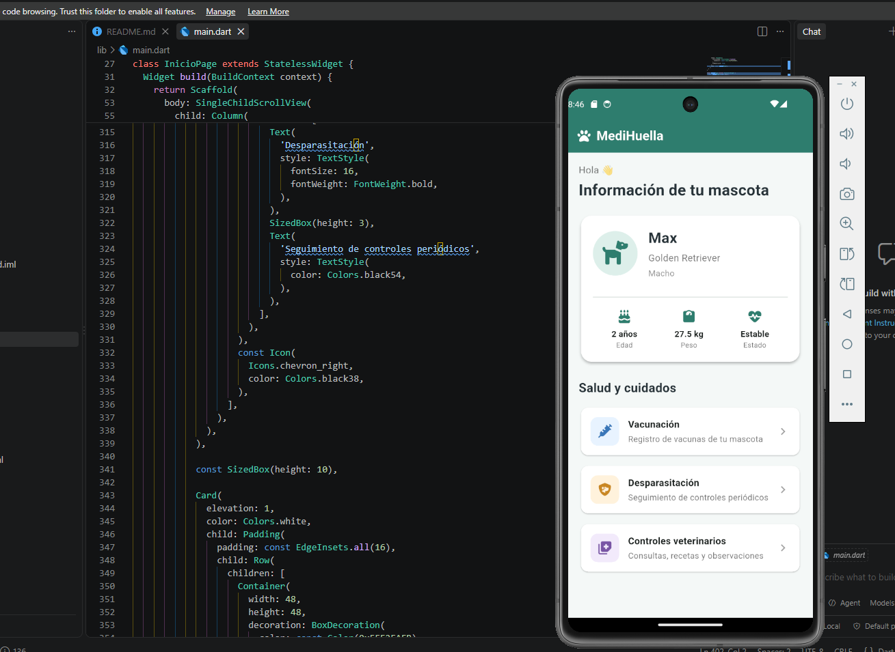  |
| Emulador Android funcionando           |  |

### Paquetes externos

| Evidencia                               | Captura                                                                 |
| --------------------------------------- | ----------------------------------------------------------------------- |
| Instalación de `font_awesome_flutter`   |  |
| Paquete agregado en `pubspec.yaml`      |          |
| Instalación de `flutter_launcher_icons` |          |

### Funcionamiento de MediHuella

| Evidencia                                    | Captura                                                     |
| -------------------------------------------- | ----------------------------------------------------------- |
| Icono personalizado de MediHuella en Android | 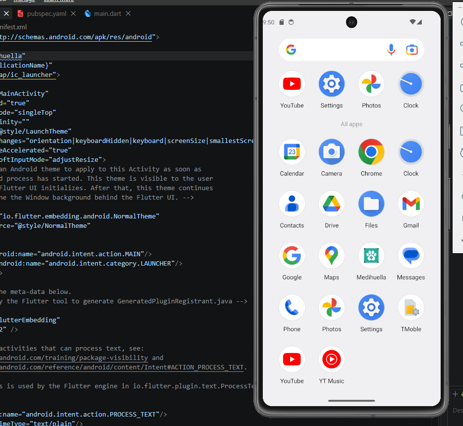     |
| Pantalla principal de la aplicación          | 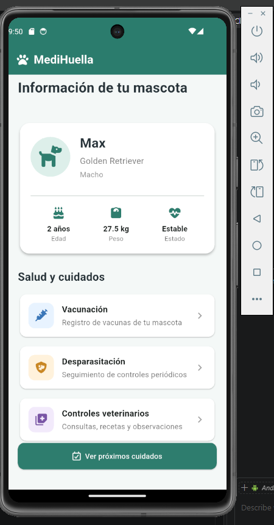 |
| Funcionamiento del botón y próximos cuidados | 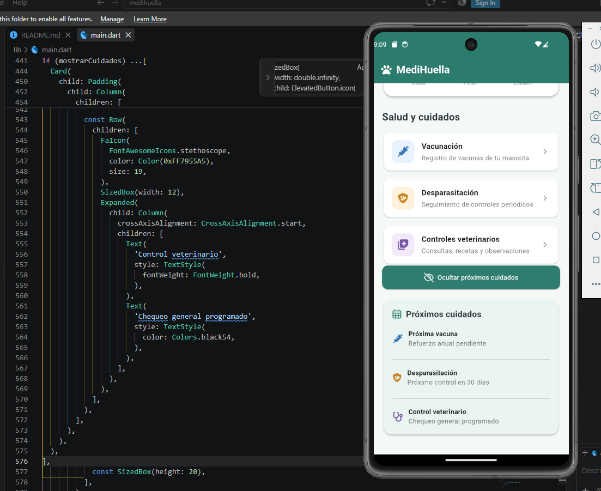         |

## Estado del proyecto

La primera versión de MediHuella permite visualizar la información principal de una mascota y consultar de forma interactiva sus próximos cuidados.

Esta versión constituye la base del proyecto y permitirá incorporar nuevas funcionalidades en futuras actividades, como un historial más completo de salud, registros adicionales y nuevas pantallas.

---

# Actividad Integradora 2

## Desarrollo de una Aplicación Flutter con Navegación y Nuevos Widgets

Para la Actividad Integradora 2 se continuó el desarrollo de **MediHuella**, aplicación iniciada en la Actividad Integradora 1.

En esta nueva versión se amplió el proyecto incorporando varias pantallas, navegación mediante `Navigator`, nuevos widgets, componentes reutilizables, manejo de estado con `setState()`, registro dinámico de vacunas, diálogos, mensajes de confirmación y un nuevo paquete externo para el manejo de fechas.

## Nuevas funcionalidades

MediHuella ahora permite:

- Navegar entre cuatro pantallas relacionadas con la salud de la mascota.
- Consultar información general de Max.
- Visualizar el historial de vacunas.
- Consultar las próximas vacunas.
- Registrar nuevas vacunas.
- Visualizar controles veterinarios realizados.
- Consultar próximos controles veterinarios.
- Visualizar una ficha completa de la mascota.
- Mostrar fechas con formato utilizando el paquete `intl`.
- Mostrar mensajes de confirmación mediante `SnackBar`.
- Registrar información mediante un `AlertDialog`.
- Actualizar dinámicamente la información utilizando `setState()`.
- Utilizar componentes reutilizables organizados en la carpeta `widgets`.
- Mostrar el logo e icono personalizado de MediHuella.

## Organización del proyecto

El código principal de la aplicación se encuentra organizado de la siguiente manera:

```text
lib/
├── main.dart
├── screens/
│   ├── pantalla_inicio.dart
│   ├── pantalla_vacunas.dart
│   ├── pantalla_controles.dart
│   └── pantalla_perfil.dart
└── widgets/
    ├── tarjeta_acceso.dart
    ├── tarjeta_mascota.dart
    ├── tarjeta_vacuna.dart
    ├── tarjeta_control.dart
    └── logo_medihuella.dart
```

Esta organización permite mantener `main.dart` únicamente con la configuración general de la aplicación y las rutas, separando las pantallas y los componentes visuales en archivos independientes.

## Pantallas de la aplicación

### 1. Pantalla de Inicio

La pantalla principal presenta un resumen de Max y permite acceder a las diferentes funciones de MediHuella.

Desde esta pantalla se puede navegar hacia:

- Vacunas.
- Controles veterinarios.
- Perfil de Max.

La navegación se realiza utilizando:

```dart
Navigator.pushNamed(context, '/vacunas');
```

También se utilizan las rutas:

```text
/inicio
/vacunas
/controles
/perfil
```

### 2. Pantalla de Vacunas

La pantalla de vacunas permite visualizar el historial de vacunación de Max y su próxima vacuna.

También incorpora un botón flotante:

```dart
FloatingActionButton
```

que permite registrar una nueva vacuna.

Al presionarlo se muestra un:

```dart
AlertDialog
```

donde el usuario puede escribir el nombre de la vacuna.

Después del registro, la vacuna aparece inmediatamente en el historial y se muestra un mensaje de confirmación mediante:

```dart
SnackBar
```

### 3. Pantalla de Controles Veterinarios

Esta pantalla muestra los controles veterinarios realizados y el próximo control programado.

Cada control contiene información como:

- Tipo de control.
- Fecha.
- Veterinario.
- Descripción.
- Estado del control.

Las fechas se formatean utilizando el paquete externo `intl`.

### 4. Pantalla de Perfil

La pantalla de perfil presenta información más completa de Max:

- Nombre.
- Especie.
- Raza.
- Sexo.
- Edad.
- Peso.
- Estado general.
- Número de ficha MediHuella.

También se agregó el logo personalizado de MediHuella dentro de la interfaz.

## Widgets utilizados

Durante esta actividad se utilizaron, entre otros, los siguientes widgets:

- `MaterialApp`
- `Scaffold`
- `AppBar`
- `ListView`
- `ListTile`
- `Card`
- `CircleAvatar`
- `Divider`
- `Image`
- `Icon`
- `FaIcon`
- `FloatingActionButton`
- `ElevatedButton`
- `TextButton`
- `Padding`
- `SizedBox`
- `Expanded`
- `Container`
- `Row`
- `Column`
- `TextField`
- `AlertDialog`
- `SnackBar`

Además, se crearon widgets propios reutilizables:

```text
TarjetaAcceso
TarjetaMascota
TarjetaVacuna
TarjetaControl
LogoMediHuella
```

## Manejo de estado con setState

Para demostrar el manejo básico de estado se convirtió la pantalla de vacunas en un `StatefulWidget`.

La aplicación mantiene una lista con las vacunas registradas:

```dart
final List<Map<String, dynamic>> vacunasAplicadas = [
  {
    'nombre': 'Rabia',
    'fecha': DateTime(2026, 2, 15),
    'descripcion': 'Vacuna antirrábica anual.',
  },
  {
    'nombre': 'Múltiple canina',
    'fecha': DateTime(2025, 11, 10),
    'descripcion': 'Protección contra enfermedades virales comunes.',
  },
];
```

Cuando el usuario registra una nueva vacuna se utiliza:

```dart
setState(() {
  vacunasAplicadas.add({
    'nombre': nombreVacuna,
    'fecha': DateTime.now(),
    'descripcion': 'Vacuna registrada desde MediHuella.',
  });
});
```

`setState()` informa a Flutter que la información cambió y que debe reconstruir la interfaz.

Como resultado:

- La nueva vacuna aparece inmediatamente.
- El contador del historial aumenta.
- No es necesario reiniciar la aplicación.

Los datos agregados durante esta actividad se mantienen únicamente mientras la aplicación está ejecutándose, ya que no se implementó todavía almacenamiento permanente.

## Paquete externo utilizado en la Actividad 2

### intl

Para esta actividad se agregó el paquete:

```yaml
intl: ^0.20.3
```

Su función es permitir el manejo y formato de fechas.

Por ejemplo:

```dart
final String fechaFormateada =
    DateFormat('dd/MM/yyyy').format(fecha);
```

De esta manera se trabaja internamente con objetos `DateTime`, mientras que el usuario visualiza fechas en formato:

```text
dd/MM/yyyy
```

El paquete se utiliza tanto en vacunas como en controles veterinarios.

Instalación:

```bash
flutter pub add intl
```

## Interacciones implementadas

La aplicación contiene diferentes acciones realizadas por el usuario.

### Navegación entre pantallas

Desde la pantalla principal se utilizan tarjetas que permiten navegar mediante `Navigator.pushNamed`.

### Registro de vacunas

El botón **Agregar vacuna** abre un `AlertDialog`.

El usuario escribe el nombre de la vacuna y selecciona **Registrar**.

La información se agrega al historial utilizando `setState()`.

### Mensaje de confirmación

Después del registro se muestra un `SnackBar` indicando que la vacuna fue registrada correctamente.

Estas funcionalidades permiten cumplir con los requisitos de interacción solicitados para la actividad.

## Personalización

La aplicación mantiene una identidad visual propia.

### Nombre

El nombre de la aplicación es:

**MediHuella**

También se configuró este nombre en Android mediante:

```xml
android:label="MediHuella"
```

### Colores

El color principal utilizado es un tono verde relacionado con salud y bienestar:

```dart
Color(0xFF2E7D6E)
```

También se utilizan tonos complementarios verdes, azules, violetas y amarillos para diferenciar las diferentes secciones.

### Logo e icono

MediHuella cuenta con un icono personalizado compuesto por:

- Una huella de mascota.
- Un símbolo médico.
- Fondo verde/turquesa.

El archivo principal se encuentra en:

```text
assets/icon/app_icon.png
```

La imagen también se utiliza dentro de la interfaz mediante:

```dart
Image.asset('assets/icon/app_icon.png')
```

Para generar el icono de Android se utilizó `flutter_launcher_icons`.

## Evidencias de la Actividad Integradora 2

### Pantalla principal inicial

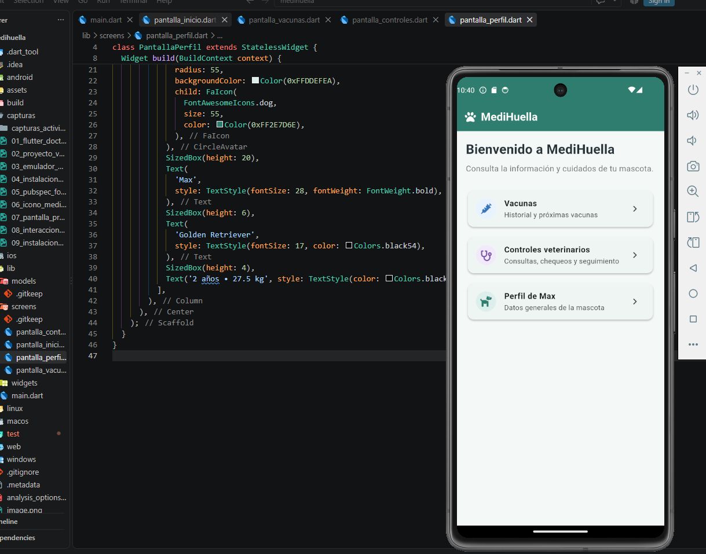

### Pantalla principal mejorada

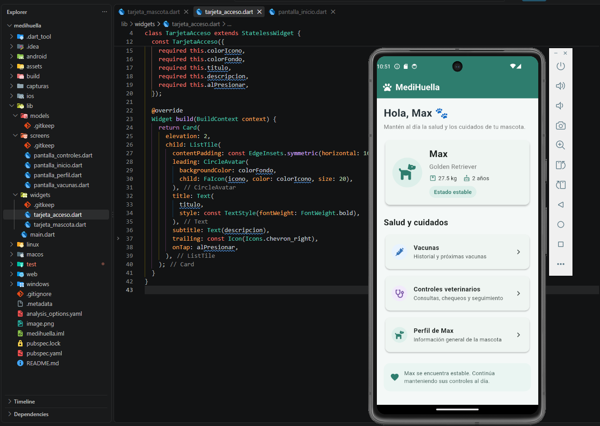

### Pantalla de vacunas

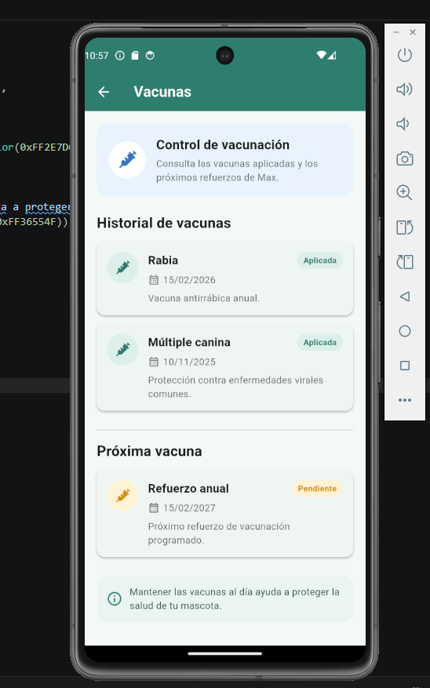

### Instalación del paquete intl

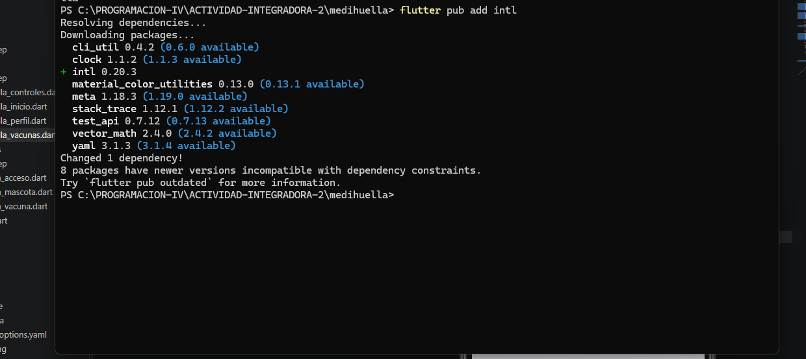

### Paquete intl en pubspec.yaml

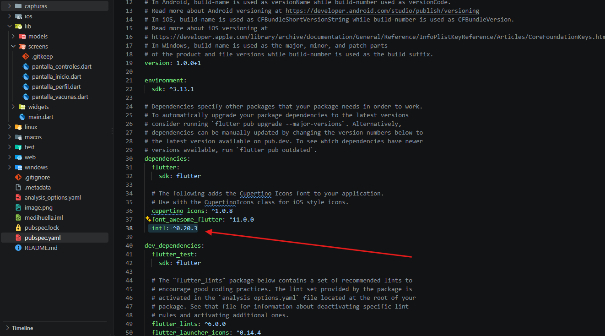

### AlertDialog para registrar una vacuna

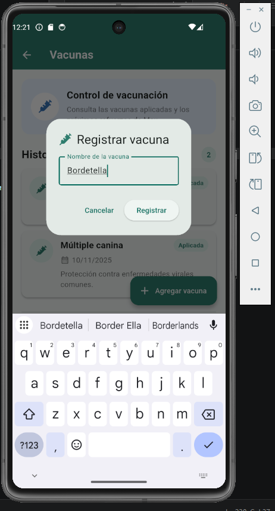

### Registro dinámico con setState y SnackBar

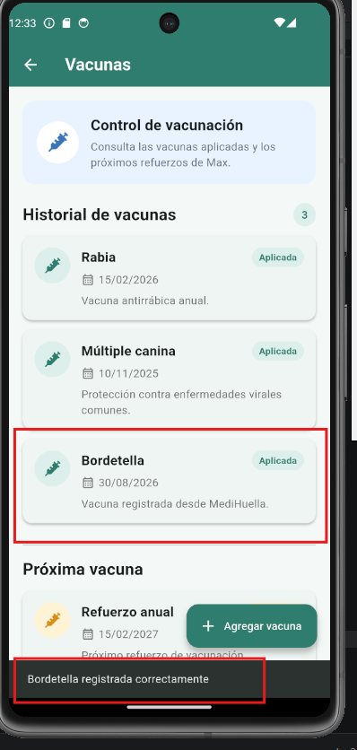

### Pantalla de controles veterinarios

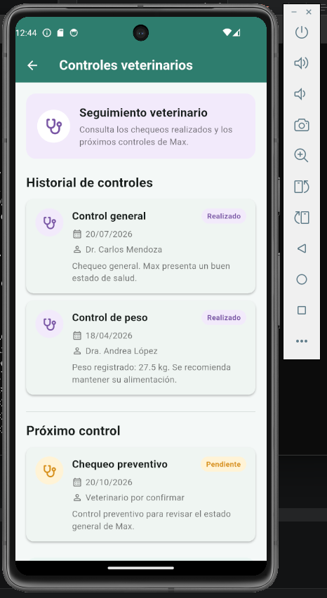

### Pantalla de perfil

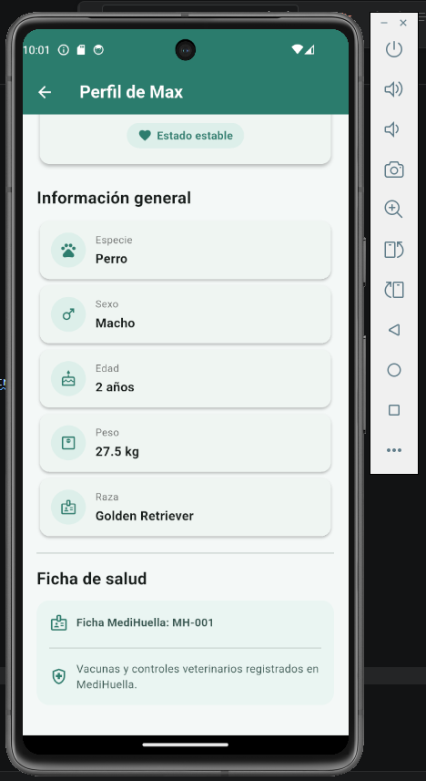

### Logo de MediHuella dentro de la aplicación

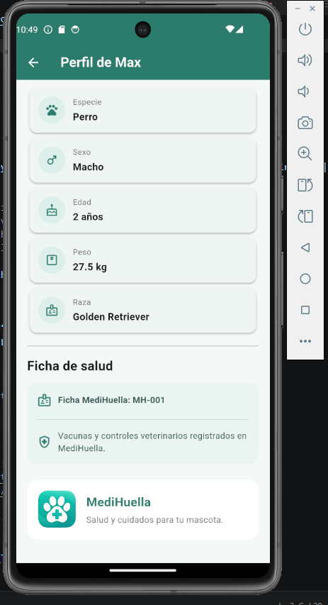

### Icono y nombre personalizado en Android

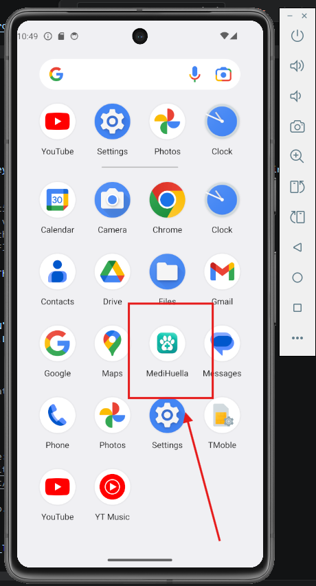

## Ejecución de la Actividad 2

Desde la carpeta del proyecto se deben obtener las dependencias:

```bash
flutter pub get
```

Comprobar los dispositivos disponibles:

```bash
flutter devices
```

Ejecutar la aplicación:

```bash
flutter run
```

También se puede indicar directamente el dispositivo:

```bash
flutter run -d ID_DEL_EMULADOR
```

## Cumplimiento de requisitos

| Requisito                   | Implementación                                                                                     |
| --------------------------- | -------------------------------------------------------------------------------------------------- |
| `MaterialApp`               | Configuración principal de MediHuella                                                              |
| `Scaffold`                  | Utilizado en las cuatro pantallas                                                                  |
| `AppBar`                    | Presente en las cuatro pantallas                                                                   |
| Cuatro pantallas            | Inicio, Vacunas, Controles y Perfil                                                                |
| `Navigator`                 | Navegación mediante rutas nombradas                                                                |
| Organización en carpetas    | `screens` y `widgets`                                                                              |
| Más de cinco widgets nuevos | `ListView`, `ListTile`, `Card`, `CircleAvatar`, `Divider`, `Image`, `FloatingActionButton` y otros |
| Dos o más acciones          | Navegación, `AlertDialog`, registro y `SnackBar`                                                   |
| `setState()`                | Registro dinámico de vacunas                                                                       |
| Paquete externo             | `intl`                                                                                             |
| Nombre personalizado        | MediHuella                                                                                         |
| Icono personalizado         | Huella con símbolo médico                                                                          |
| Logo representativo         | Utilizado dentro de la pantalla de perfil                                                          |
| Colores personalizados      | Tema principal verde/turquesa                                                                      |
| README actualizado          | Documentación de Actividad 1 y Actividad 2                                                         |
| Evidencias                  | Capturas de pantallas, interacción, paquete y personalización                                      |

## Estado de la Actividad 2

La segunda versión de MediHuella amplía la aplicación original incorporando navegación, múltiples pantallas, componentes reutilizables, manejo de fechas y registro dinámico de información.

La aplicación permite demostrar los conceptos principales estudiados durante la asignatura manteniendo una estructura sencilla y organizada.

## Repositorio de la Actividad Integradora 2

El código fuente de esta versión se encuentra en:

https://github.com/kevingeovanny16/PROGRAMACION-IV/tree/main/ACTIVIDAD-INTEGRADORA-2/medihuella

---

# Actividad Integradora 3

## Desarrollo de una aplicación Flutter con Provider y componentes reutilizables

Para la **Actividad Integradora 3** se continuó el desarrollo de **MediHuella**, incorporando manejo de estado global con el paquete `provider`, listas dinámicas, modelos de datos y componentes reutilizables.

La funcionalidad principal de esta versión consiste en demostrar que un cambio realizado en una pantalla puede reflejarse automáticamente en otra pantalla mediante `ChangeNotifier`, `notifyListeners()`, `ChangeNotifierProvider` y `Consumer`.

## Objetivo de la Actividad 3

Desarrollar una aplicación Flutter organizada en diferentes carpetas y componentes reutilizables, incorporando manejo de estado mediante `Provider`, navegación entre pantallas, listas dinámicas y actualización automática de información compartida.

## Funcionalidades principales

MediHuella permite en esta versión:

- Navegar entre Inicio, Vacunas, Controles veterinarios y Perfil.
- Consultar la información general de Max.
- Visualizar el historial dinámico de vacunas.
- Registrar nuevas vacunas mediante `AlertDialog`.
- Eliminar vacunas con confirmación.
- Mostrar la próxima vacuna programada.
- Actualizar automáticamente el contador y la última vacuna mostrados en Inicio.
- Seleccionar una fotografía de Max desde la galería.
- Compartir la fotografía entre Perfil e Inicio mediante Provider.
- Editar el peso y el estado de salud de Max.
- Reflejar los datos editados automáticamente en Inicio.
- Mostrar mensajes de confirmación mediante `SnackBar`.
- Construir el historial mediante `ListView.builder`.
- Utilizar modelos, datos iniciales y widgets reutilizables.

## Tecnologías y paquetes utilizados

- Flutter 3.47.1
- Dart 3.13.1
- Material Design
- `provider: ^6.1.5+1`
- `image_picker: ^1.2.3`
- `intl: ^0.20.3`
- `font_awesome_flutter: ^11.0.0`
- `flutter_launcher_icons`

### Provider

El paquete `provider` administra el estado compartido de la aplicación.

Instalación:

```bash
flutter pub add provider
```

### image_picker

El paquete `image_picker` permite seleccionar una fotografía de la mascota desde la galería del dispositivo.

```bash
flutter pub add image_picker
```

## Organización del proyecto

```text
lib/
├── main.dart
├── screens/
│   ├── pantalla_inicio.dart
│   ├── pantalla_vacunas.dart
│   ├── pantalla_controles.dart
│   └── pantalla_perfil.dart
├── providers/
│   ├── proveedor_vacunas.dart
│   └── proveedor_mascota.dart
├── models/
│   └── vacuna.dart
├── data/
│   └── datos_vacunas.dart
└── widgets/
    ├── tarjeta_acceso.dart
    ├── tarjeta_mascota.dart
    ├── tarjeta_vacuna.dart
    ├── tarjeta_control.dart
    ├── logo_medihuella.dart
    └── resumen_vacunas.dart
```

La estructura separa las pantallas, el estado, los modelos, los datos iniciales y los componentes visuales para evitar concentrar toda la lógica en `main.dart`.

## Modelo de datos

Se creó la clase `Vacuna` para representar cada registro de vacunación mediante:

- Nombre.
- Fecha.
- Descripción.
- Estado de aplicación.

De esta manera el historial trabaja con objetos tipados en lugar de mapas genéricos.

## Manejo de estado con Provider

La aplicación utiliza dos proveedores:

```text
ProveedorVacunas
ProveedorMascota
```

Ambos heredan de:

```dart
ChangeNotifier
```

Cuando un dato cambia se ejecuta:

```dart
notifyListeners();
```

Esto hace que los widgets que escuchan el Provider se reconstruyan automáticamente.

### Configuración global

En `main.dart` se utiliza `MultiProvider`:

```dart
MultiProvider(
  providers: [
    ChangeNotifierProvider(
      create: (_) => ProveedorVacunas(),
    ),
    ChangeNotifierProvider(
      create: (_) => ProveedorMascota(),
    ),
  ],
  child: const AplicacionMediHuella(),
)
```

## Proveedor de vacunas

`ProveedorVacunas` administra:

- Lista de vacunas.
- Cantidad de vacunas.
- Última vacuna registrada.
- Próxima vacuna.
- Registro de nuevas vacunas.
- Eliminación de vacunas.

Cuando una vacuna se registra o elimina, el Provider ejecuta `notifyListeners()`. Como resultado se actualizan tanto la pantalla de Vacunas como el resumen mostrado en Inicio.

```text
Pantalla Vacunas
      ↓
Agregar o eliminar vacuna
      ↓
ProveedorVacunas
      ↓
notifyListeners()
      ↓
Vacunas actualiza su historial
      +
Inicio actualiza contador y última vacuna
```

Este flujo demuestra el requisito de modificar el estado en una pantalla y reflejar el cambio en otra mediante Provider.

## Proveedor de mascota

`ProveedorMascota` administra:

- Fotografía seleccionada.
- Peso de Max.
- Estado de salud.

Al seleccionar una foto desde Perfil:

```text
Perfil → image_picker → ProveedorMascota → notifyListeners() → Perfil e Inicio
```

Al editar el peso o el estado de salud ocurre el mismo proceso, por lo que la tarjeta de Max en Inicio cambia automáticamente.

## Uso de Consumer

Los cambios se escuchan mediante:

```dart
Consumer<ProveedorVacunas>
```

```dart
Consumer<ProveedorMascota>
```

Para ejecutar acciones sin escuchar cambios permanentemente también se utiliza `context.read<...>()`.

## Lista dinámica de vacunas

El historial se genera con:

```dart
ListView.builder
```

Su número de elementos depende de la lista mantenida por `ProveedorVacunas`. Al agregar o eliminar un registro la lista se reconstruye automáticamente.

## Registro y eliminación de vacunas

El botón **Agregar vacuna** abre un `AlertDialog` donde se ingresa el nombre del nuevo registro. Después de guardar:

- La vacuna aparece en el historial.
- El contador aumenta.
- Inicio refleja la nueva cantidad.
- Se actualiza la última vacuna registrada.
- Se muestra un `SnackBar`.

Cada vacuna del historial también incorpora una opción de eliminación. Antes de borrar el registro se muestra un `AlertDialog` de confirmación. Si el usuario confirma, el Provider elimina la vacuna y actualiza las pantallas relacionadas.

La tarjeta de **Próxima vacuna** no tiene opción de eliminar porque corresponde a una programación futura y no al historial de vacunas aplicadas.

## Fotografía de la mascota

Desde Perfil se puede seleccionar una imagen utilizando `ImagePicker`.

Después de escogerla:

- Se muestra en Perfil.
- Se muestra en Inicio.
- Puede cambiarse posteriormente.

La fotografía se mantiene mientras la aplicación está ejecutándose. En esta actividad no se implementó almacenamiento permanente.

## Edición de datos de Max

La opción **Editar datos** permite cambiar:

- Peso.
- Estado de salud.

Estados disponibles:

```text
Estable
En observación
Requiere control
```

Los cambios se reflejan automáticamente en Perfil y en la tarjeta de Max de Inicio.

## Componentes reutilizables

### TarjetaAcceso

Permite navegar desde Inicio hacia Vacunas, Controles y Perfil.

### TarjetaMascota

Muestra la fotografía, peso y estado de Max leyendo los datos desde `ProveedorMascota`.

### TarjetaVacuna

Recibe directamente un objeto `Vacuna` y muestra nombre, fecha, descripción, estado y la opción de eliminación cuando corresponde.

### TarjetaControl

Representa los controles veterinarios registrados.

### LogoMediHuella

Reutiliza el logo de MediHuella dentro de la interfaz.

### ResumenVacunas

Muestra en Inicio la cantidad de vacunas, la última vacuna registrada y su fecha utilizando `Consumer<ProveedorVacunas>`.

## Navegación

La aplicación mantiene cuatro rutas relacionadas:

```text
/inicio
/vacunas
/controles
/perfil
```

Ejemplo:

```dart
Navigator.pushNamed(context, '/vacunas');
```

## Evidencias de la Actividad Integradora 3

Las evidencias se encuentran en:

```text
capturas/capturas_actividad_3/
```

### Instalación de Provider

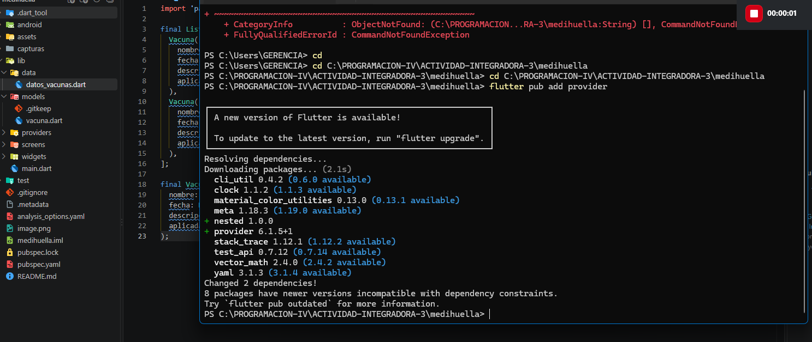

### Provider agregado en pubspec.yaml

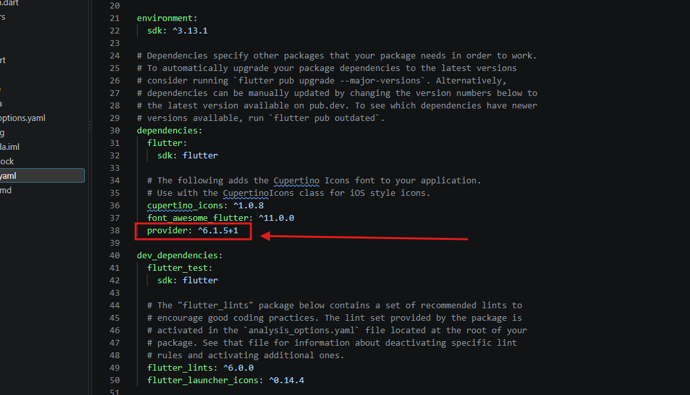

### Pantalla de Vacunas y registro dinámico

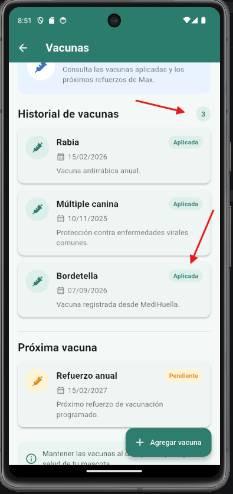

### Pantalla Inicio con estado inicial

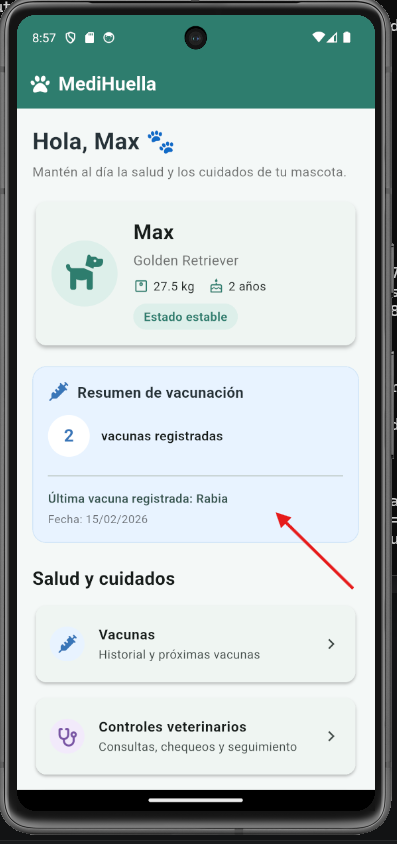

### Estado compartido entre Vacunas e Inicio

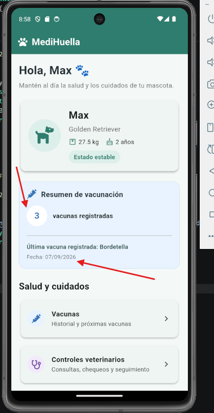

Esta evidencia muestra que una vacuna registrada en otra pantalla actualiza automáticamente el resumen de Inicio.

### Instalación de image_picker

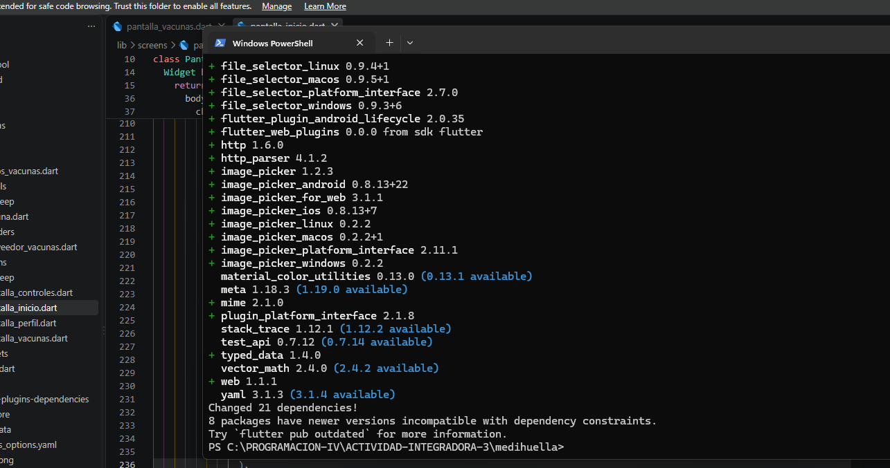

### Pantalla Perfil con fotografía seleccionada

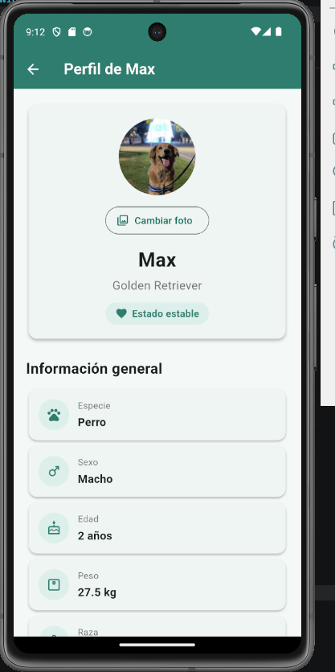

### Fotografía compartida en Inicio

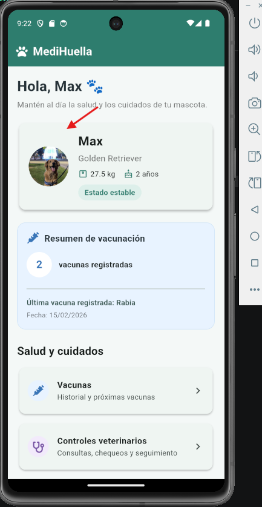

### Perfil con datos editados

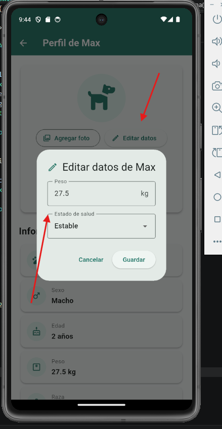

### Datos editados reflejados en Inicio

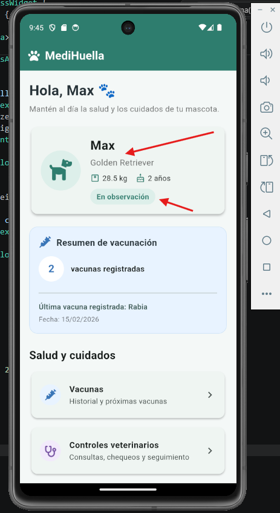

### Confirmación para eliminar una vacuna

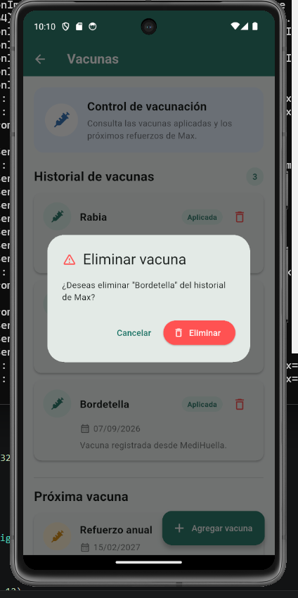

### Vacuna eliminada y estado actualizado

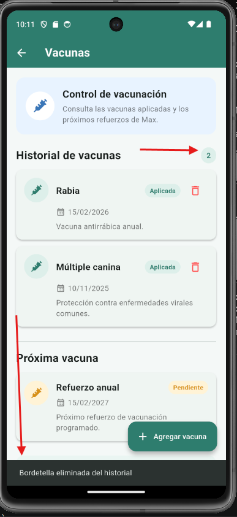

## Ejecución de la Actividad 3

Obtener las dependencias:

```bash
flutter pub get
```

Comprobar los dispositivos:

```bash
flutter devices
```

Ejecutar la aplicación:

```bash
flutter run
```

También se puede indicar un dispositivo específico:

```bash
flutter run -d ID_DEL_EMULADOR
```

Durante el desarrollo se utilizó:

```bash
flutter run -d emulator-5554
```

## Cumplimiento de requisitos de la Actividad 3

| Requisito | Implementación |
| --- | --- |
| `MaterialApp` | Configuración principal en `main.dart` |
| `Scaffold` | Utilizado en las cuatro pantallas |
| `AppBar` | Presente en las pantallas principales |
| Cuatro pantallas | Inicio, Vacunas, Controles y Perfil |
| Navegación | `Navigator` mediante rutas nombradas |
| Organización por carpetas | `screens`, `providers`, `models`, `data` y `widgets` |
| Provider | Estado real de vacunas y mascota |
| `ChangeNotifier` | `ProveedorVacunas` y `ProveedorMascota` |
| `notifyListeners()` | Ejecutado al modificar el estado |
| `ChangeNotifierProvider` | Configurado dentro de `MultiProvider` |
| `Consumer` | Escucha cambios de vacunas y mascota |
| Estado compartido entre pantallas | Vacunas, foto, peso y estado de salud |
| Lista dinámica | `ListView.builder` en el historial de vacunas |
| Modelo | Clase `Vacuna` |
| Widgets personalizados | TarjetaAcceso, TarjetaMascota, TarjetaVacuna, TarjetaControl, LogoMediHuella y ResumenVacunas |
| Imágenes | Selección mediante `image_picker` |
| Interacciones | Agregar, eliminar, editar datos, cambiar foto y navegar |
| Evidencias | Capturas de instalación, pantallas y estado compartido |
| Commits | Más de siete commits significativos |

## Commits principales de la Actividad 3

1. `Crear modelo y datos de vacunas`
2. `Instalar y configurar Provider`
3. `Migrar historial de vacunas a Provider`
4. `Compartir estado de vacunación entre pantallas`
5. `Agregar selección de foto de mascota`
6. `Compartir foto de mascota mediante Provider`
7. `Mejorar listas dinámicas y componentes reutilizables`
8. `Permitir editar datos de la mascota con Provider`
9. `Agregar eliminación de vacunas con Provider`
10. `Actualizar README y agregar evidencias de Actividad 3`

## Estado de la Actividad 3

La tercera versión de MediHuella incorpora manejo de estado global con Provider y permite compartir información entre diferentes pantallas sin pasar los datos manualmente entre ellas.

Se demuestra el uso de:

```text
ChangeNotifier
notifyListeners()
ChangeNotifierProvider
MultiProvider
Consumer
ListView.builder
Modelos
Widgets reutilizables
Navigator
AlertDialog
SnackBar
image_picker
```

Los datos administrados mediante Provider se mantienen durante la ejecución actual de la aplicación. No se implementó persistencia en almacenamiento local o base de datos para esta actividad.

## Autor

**Kevin Geovanny Minga Espinoza**

## Repositorio de la Actividad Integradora 3

El código fuente de esta versión se encuentra en:

https://github.com/kevingeovanny16/PROGRAMACION-IV/tree/main/ACTIVIDAD-INTEGRADORA-3/medihuella
